# ДЗ-8 Monitoring / Observability

Это учебный стенд для ДЗ-8 по observability ML-сервиса.

Что тут сделано:

- маленький FastAPI ML-service с `/health`, `/predict`, `/metrics`
- Prometheus забирает метрики сервиса
- Grafana показывает latency / request rate / target up + alert `HighLatency`
- Evidently строит data drift report и drift tests
- PostgreSQL + DQOps показывают data quality/schema check
- Redpanda используется как Kafka-compatible broker для VPP стрим-демо
- VPP поток показывает связку `frames -> processed_frames`

## 1. Где что лежит

Главные файлы:

- ноутбук: [HW8_Monitoring_НовиковИван.ipynb](HW8_Monitoring_НовиковИван.ipynb)
- скриншоты: [screenshots/](screenshots/) и описание [screenshots/README.md](screenshots/README.md)
- отчеты Evidently / VPP: [reports/](reports/)
- docker-стенд: [docker-compose.yml](docker-compose.yml)
- ML-service: [app.py](app.py)
- Prometheus: [prometheus.yml](prometheus.yml), [alert_rules.yml](alert_rules.yml)
- Grafana provisioning: [grafana/provisioning/](grafana/provisioning/)
- DQOps/PostgreSQL SQL: [sql/](sql/)
- VPP scripts: [scripts/vpp_producer.py](scripts/vpp_producer.py), [scripts/vpp_consumer.py](scripts/vpp_consumer.py)

Структура папки:

```text
DZ8/
|-- README.md
|-- HW8_Monitoring_НовиковИван.ipynb
|-- requirements.txt
|-- Dockerfile
|-- Makefile
|-- app.py
|-- docker-compose.yml
|-- prometheus.yml
|-- alert_rules.yml
|-- grafana/
|   `-- provisioning/
|       |-- datasources/
|       |   `-- prometheus.yaml
|       |-- dashboards/
|       |   |-- dashboards.yaml
|       |   `-- dashboard-dz8-ml-service.json
|       `-- alerting/
|           |-- alert_rules.yaml
|           |-- contact_points.yaml
|           `-- notification_policies.yaml
|-- scripts/
|   |-- smoke_requests.py
|   |-- generate_drift_report.py
|   |-- create_vpp_diagram.py
|   |-- create_topics.py
|   |-- take_screenshots.py
|   |-- vpp_producer.py
|   `-- vpp_consumer.py
|-- sql/
|   |-- init_orders.sql
|   `-- break_orders_schema.sql
|-- reports/
|   |-- data_drift_report.html
|   |-- data_drift_tests.html
|   |-- degradation_metrics.json
|   |-- vpp_architecture.png
|   `-- vpp_stream_demo.log
`-- screenshots/
    |-- README.md
    |-- 1.png
    |-- ...
    `-- 13.png
```

## 2. Запуск

Сначала Python-зависимости из [requirements.txt](requirements.txt):

```bash
python3 -m venv .venv
.venv/bin/pip install --upgrade pip
.venv/bin/pip install -r requirements.txt
.venv/bin/python -m playwright install chromium
```

Потом контейнеры:

```bash
docker compose up -d
docker compose ps
```

Ожидаемо поднимаются:

- `dz8_ml_service` - FastAPI сервис
- `dz8_prometheus` - сбор метрик
- `dz8_grafana` - дашборд + алерты
- `dz8_postgres` - таблица `customer_orders`
- `dz8_dqops` - интерфейс для DQOps
- `dz8_redpanda` - Kafka-compatible broker для VPP

Порты:

| сервис | URL |
|---|---|
| ML-сервис | `http://localhost:8000` |
| Prometheus | `http://localhost:9090` |
| Grafana | `http://localhost:3000` |
| DQOps | `http://localhost:8888` |
| Redpanda Kafka API | `localhost:9092` |
| PostgreSQL | `localhost:5432` |

## 3. YAML-конфиги

Тут почти все настраивается файлами, без кликов в UI.

- [prometheus.yml](prometheus.yml) - говорит Prometheus, что надо scrape-ить `ml_service:8000/metrics`
- [alert_rules.yml](alert_rules.yml) - правило `HighLatency`, т.е. p95 latency выше порога
- [grafana/provisioning/datasources/prometheus.yaml](grafana/provisioning/datasources/prometheus.yaml) - подключает Prometheus как datasource
- [grafana/provisioning/dashboards/dashboards.yaml](grafana/provisioning/dashboards/dashboards.yaml) - подхватывает dashboard при старте Grafana
- [grafana/provisioning/dashboards/dashboard-dz8-ml-service.json](grafana/provisioning/dashboards/dashboard-dz8-ml-service.json) - сам dashboard
- [grafana/provisioning/alerting/alert_rules.yaml](grafana/provisioning/alerting/alert_rules.yaml) - Grafana alert rule
- [grafana/provisioning/alerting/contact_points.yaml](grafana/provisioning/alerting/contact_points.yaml) - contact point
- [grafana/provisioning/alerting/notification_policies.yaml](grafana/provisioning/alerting/notification_policies.yaml) - routing для alert

То есть схема такая:

```text
docker compose up
  -> ml_service отдает /metrics
  -> prometheus.yml забирает метрики
  -> Grafana provisioning подключает datasource/dashboard/alert
  -> slow-запросы поднимают p95 latency
  -> HighLatency переходит в firing
```

## 4. Проверка сервиса и метрик

Проверка сервиса:

Скрипт: [scripts/smoke_requests.py](scripts/smoke_requests.py).

```bash
.venv/bin/python scripts/smoke_requests.py
curl -s http://localhost:8000/health
curl -s http://localhost:8000/metrics | grep request_latency_seconds_bucket | head
```

Главная метрика latency:

```promql
histogram_quantile(0.95, sum(rate(request_latency_seconds_bucket[5m])) by (le))
```

Alert rule:

```promql
histogram_quantile(0.95, sum(rate(request_latency_seconds_bucket[5m])) by (le)) > 1
```

## 5. Метрики и SLO

| branch | metric | SLI | SLO | owner | action |
|---|---|---|---|---|---|
| business | CTR/conversion | product KPI over window | no unexpected drop | product | analyze segment / pause rollout |
| application | p95 latency | PromQL p95 over 5m | `< 1 sec` | backend/MLOps | inspect latency / rollback slow model |
| application | error rate | failed requests ratio | `< 1%` | backend/MLOps | inspect logs / rollback |
| infrastructure | availability | `up{job="ml_service"}` | `> 99%` | DevOps | restart / failover |
| ML/model | drift PSI | Evidently PSI / drift share | `< 0.2` for PSI-style threshold | DS | validate data / retrain decision |
| ML/model | degradation | accuracy/F1 on labelled batch | not worse than baseline by agreed delta | DS | retrain / rollback |
| data quality | DQ incidents | DQOps critical incidents | `0 critical` | data engineer | fix source / backfill / isolate |

**Вывод:**

- p95 latency беру как основной технический SLO
- drift/degradation отдельно, т.к. сервис может быть быстрый, но модель уже плохая
- DQOps отдельно, т.к. сломанная схема данных может поломать модель до inference

## 6. Скриншоты

Все новые скриншоты лежат в [screenshots/](screenshots/).

[screenshots/README.md](screenshots/README.md) - короткая карта по скринам: что запускалось, где видно
алерт, где drift, где DQOps и где стрим-демо для VPP.

`1.png` и `2.png` - это подготовка окружения. Они не доказывают сами метрики, но
показывают что зависимости поставлены.

### 6.1 Подготовка и запуск стенда

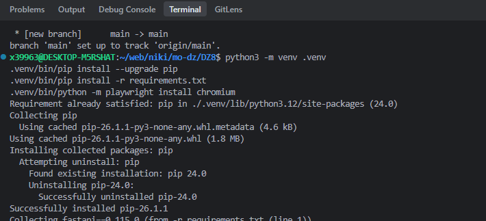

`1.png` - создан `.venv`, обновлен `pip`, запускается установка зависимостей.

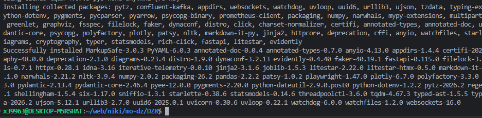

`2.png` - зависимости установились: FastAPI / prometheus-client / Evidently / psycopg / confluent-kafka и т.д.

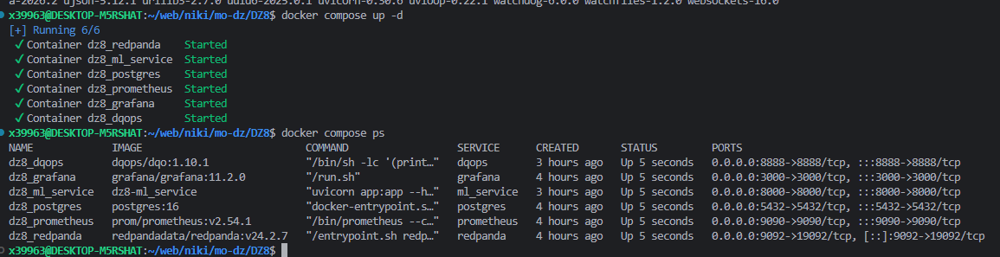

`3.png` - поднят весь compose-стенд: ML-service, Prometheus, Grafana, PostgreSQL, DQOps, Redpanda.

### 6.2 FastAPI / Prometheus / Grafana

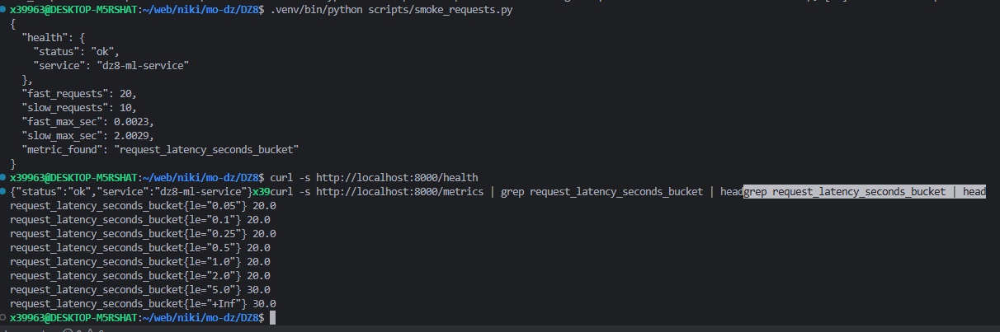

`4.png` - smoke-запросы прошли, `/health` отвечает `ok`, `/metrics` отдает `request_latency_seconds_bucket`.

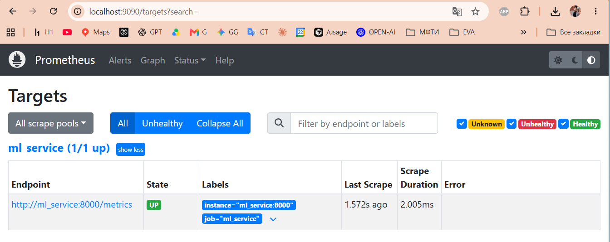

`5.png` - Prometheus видит target `ml_service` как `UP`, endpoint `/metrics` scrape-ится без ошибки.

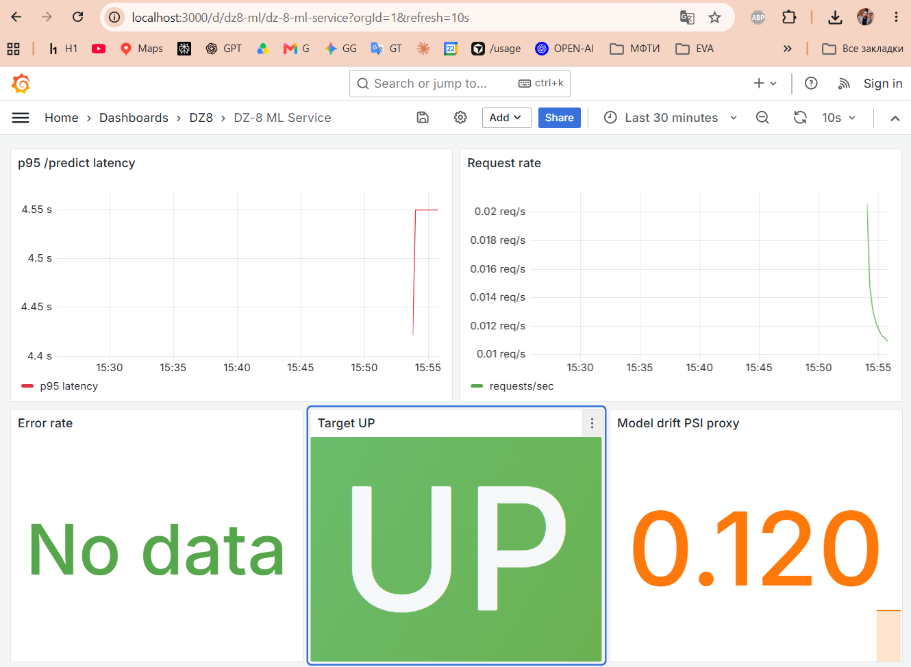

`6.png` - дашборд Grafana: p95 latency, частота запросов, target `UP`, drift proxy metric.

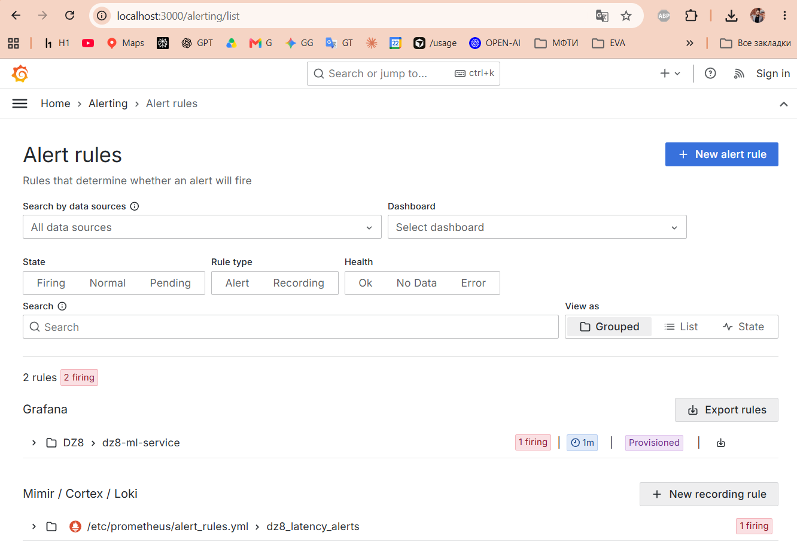

`7.png` - в Grafana видны provisioned alert rules, оба правила в состоянии `firing`.

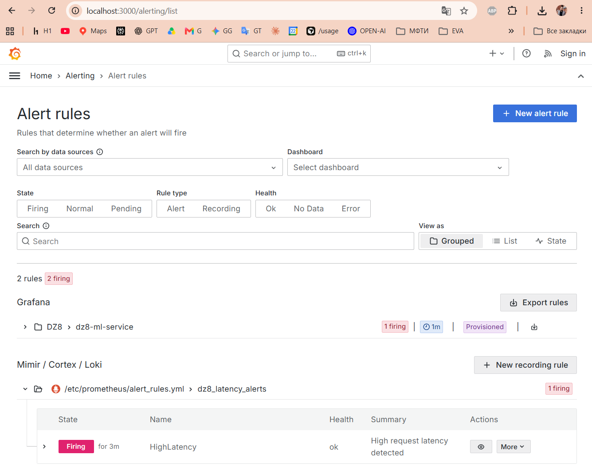

`8.png` - правило `HighLatency` реально перешло в `Firing for 3m` после slow-запросов.

### 6.3 Evidently drift / degradation

Запуск:

Скрипт: [scripts/generate_drift_report.py](scripts/generate_drift_report.py).

```bash
.venv/bin/python scripts/generate_drift_report.py
cat reports/degradation_metrics.json
```

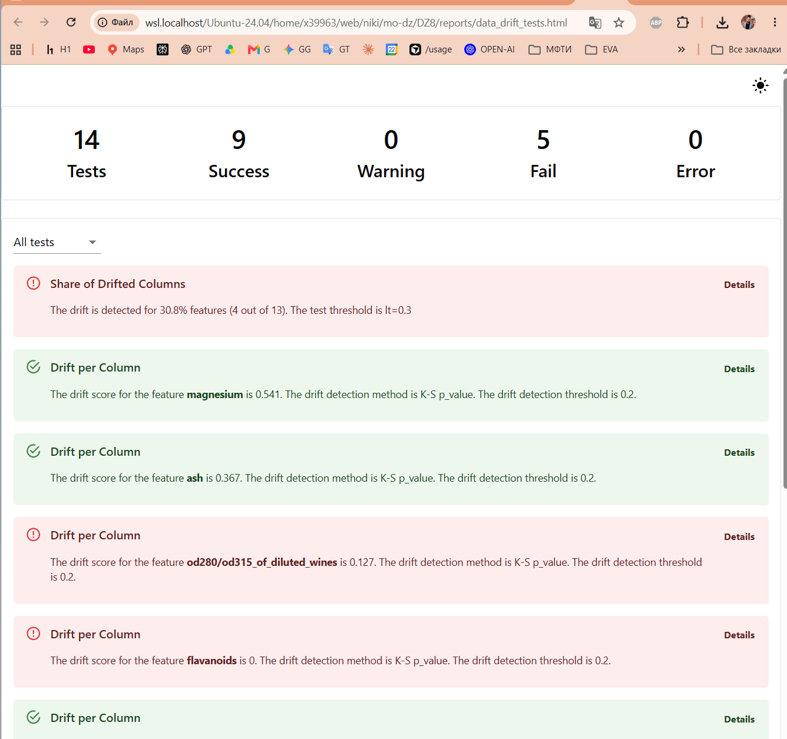

`10.png` - набор тестов Evidently: 14 tests, 9 success, 5 fail; drift найден в части признаков.

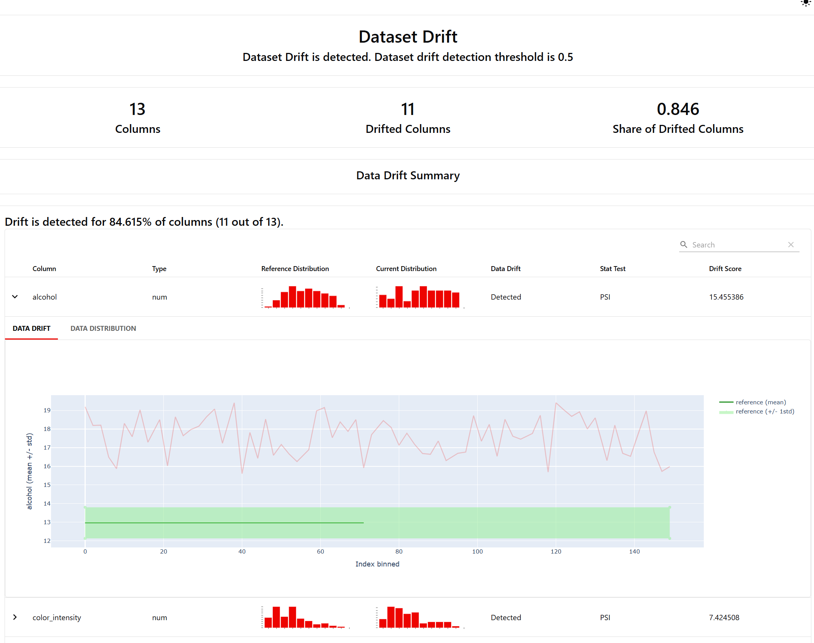

`11.png` - отчет Evidently по drift: drift detected, 11 из 13 признаков ушли в drift.

Метрики degradation лежат в [reports/degradation_metrics.json](reports/degradation_metrics.json):

```json
{
  "baseline_acc": 0.9861,
  "current_acc": 0.5972,
  "delta": -0.3889
}
```

**Вывод:**

- `data drift` видно без разметки
- `degradation` считаю отдельно по размеченному batch
- current batch специально сдвинут, т.е. это учебный стресс для ДЗ

### 6.4 DQOps / PostgreSQL

PostgreSQL стартует с таблицей `public.customer_orders` из [sql/init_orders.sql](sql/init_orders.sql).

Контролируемая поломка:

SQL-файл: [sql/break_orders_schema.sql](sql/break_orders_schema.sql).

```bash
docker exec -i dz8_postgres psql -U dz8 -d dz8 < sql/break_orders_schema.sql
```

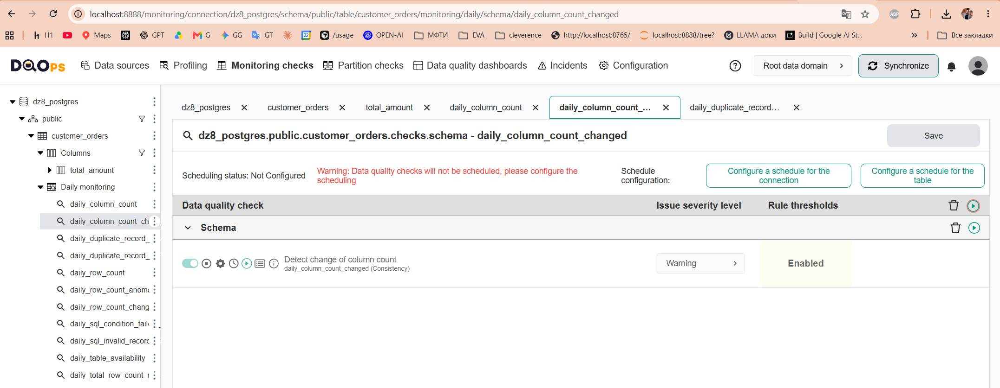

`12.png` - в DQOps включен schema monitoring check `daily_column_count_changed` для таблицы `customer_orders`.

Важно: на этом скрине видно настройку проверки, а не весь incident-list. Поэтому SQL mutation лежит отдельно в [sql/break_orders_schema.sql](sql/break_orders_schema.sql): там колонка `total_amount` переименуется в `total_amount_broken`.

### 6.5 Virtual Product Placement / Redpanda stream

Диаграмма архитектуры:

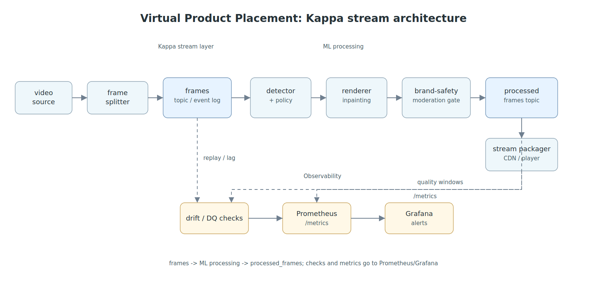

Идея VPP тут такая:

```text
video/frame events
  -> frames topic
  -> consumer имитирует ML processing
  -> processed_frames topic
```

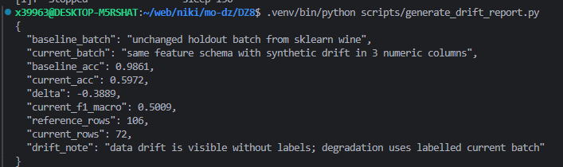

`9.png` - пример обработанного demo-frame. Сам по себе он слабый как доказательство Kafka, поэтому рядом идет лог producer/consumer.

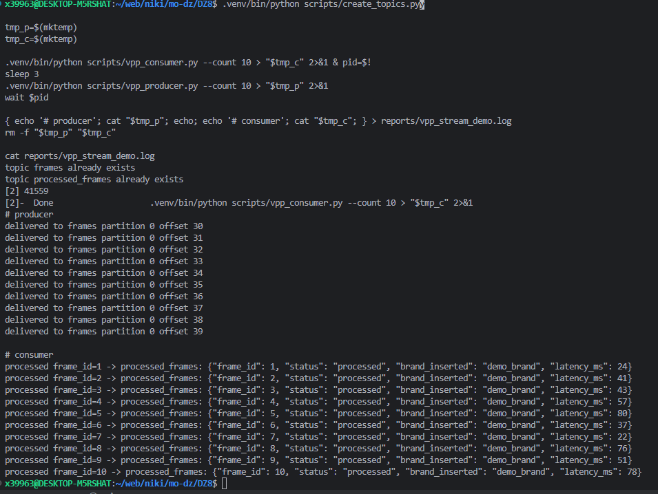

`13.png` - producer отправляет 10 событий в topic `frames`, consumer читает их и пишет результаты в `processed_frames`.

Лог сохраняется в [reports/vpp_stream_demo.log](reports/vpp_stream_demo.log).

## 7. Отчеты

| файл | зачем |
|---|---|
| [reports/data_drift_report.html](reports/data_drift_report.html) | отчет Evidently по data drift |
| [reports/data_drift_tests.html](reports/data_drift_tests.html) | тесты Evidently |
| [reports/degradation_metrics.json](reports/degradation_metrics.json) | accuracy/f1 до и после synthetic drift |
| [reports/vpp_architecture.png](reports/vpp_architecture.png) | схема Virtual Product Placement |
| [reports/vpp_stream_demo.log](reports/vpp_stream_demo.log) | producer/consumer лог Redpanda |

## 8. DQOps руками

1. открыть `http://localhost:8888`
2. добавить источник PostgreSQL
3. параметры:

| поле | значение |
|---|---|
| host | `postgres` |
| port | `5432` |
| db | `dz8` |
| user | `dqops` |
| pass | `dqops` |

4. импортировать `public.customer_orders`
5. включить проверки профиля и схемы
6. запустить checks
7. применить [sql/break_orders_schema.sql](sql/break_orders_schema.sql)
8. запустить checks еще раз
9. смотреть Incidents / failed checks в интерфейсе DQOps

## 9. VPP стрим-демо

Скрипты: [scripts/create_topics.py](scripts/create_topics.py), [scripts/vpp_producer.py](scripts/vpp_producer.py), [scripts/vpp_consumer.py](scripts/vpp_consumer.py).

```bash
.venv/bin/python scripts/create_topics.py

tmp_p=$(mktemp)
tmp_c=$(mktemp)

.venv/bin/python scripts/vpp_consumer.py --count 10 > "$tmp_c" 2>&1 & pid=$!
sleep 3
.venv/bin/python scripts/vpp_producer.py --count 10 > "$tmp_p" 2>&1
wait $pid

{ echo '# producer'; cat "$tmp_p"; echo; echo '# consumer'; cat "$tmp_c"; } > reports/vpp_stream_demo.log
rm -f "$tmp_p" "$tmp_c"
cat reports/vpp_stream_demo.log
```

**Итого по VPP:** Redpanda работает как Kafka-compatible broker, topic `frames`
хранит входящие события кадров, topic `processed_frames` - результат обработки.
